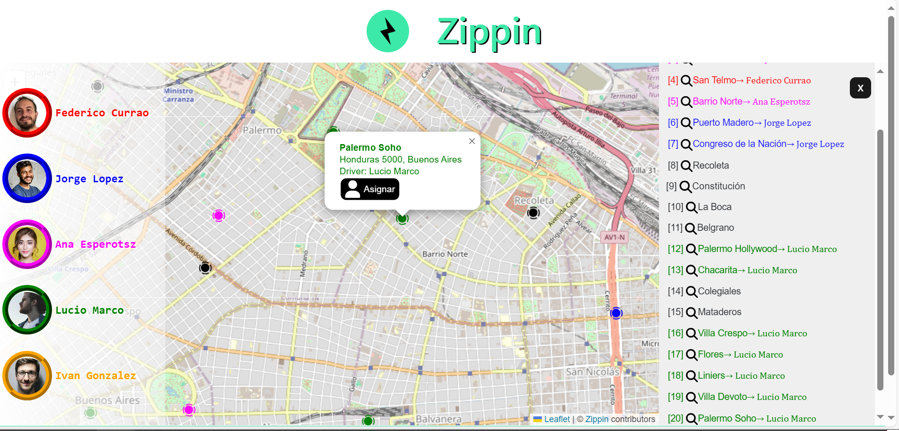
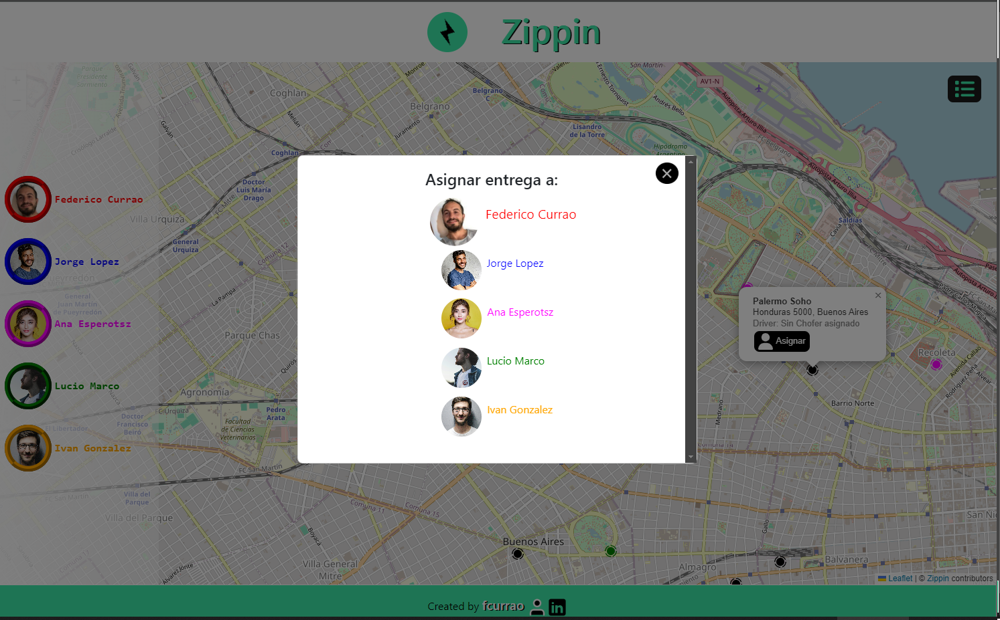

## Challenge Zippin: Aplicativo web (responsive)

### Deploy
https://zippin.netlify.app/

### Objetivo
Facilitar la planificación de entregas, permitiendo asignar a distintos choferes los trabajos que deben realizar.

User Story: Como usuario se requiere poder asignarle uno o más puntos a cada uno de los choferes

### Variables de entorno.
Las variables de entorno, por seguridad, fueron enviadas por correo electronico a quien corresponda.

--- 

### Instalacion
- Instalar las dependencias del proyecto (npm i ) en la carpeta raiz y luego ejecutar el script** npm run dev**.

- La aplicacion se vera en el puerto 5173

---

### Librerias utilizadas

-react-router-dom

-vite@latest (Creacion de proyecto) ya que create-react esta deprecada

-Leaflet: (Mapa interactivos)  (https://react-leaflet.js.org/docs/start-installation/)

-typescript

-Boostrap (framework CSS )

 
### Patrones de diseño utilizados

- Render Props
- Componentes diferentes.
- Custom Hooks 
- Context.
- Interfaces/Model
- Carpetacion modular

---

### Imagenes de Uso

**Home (Map) del aplicativo**

**Detalles deentregas**

**Responsive**

 

---

### Descripcion

- Se creó un customs hook que es useAssignPoints y se utiliza para manejar las funciones correspondientes a asignar las entrega(puntos) a los choferes.

- Otro Hook: useFetchData obtiene datos o funcionalidades de los services y los comparte a través del context. Esto se implementó para centralizar y reutilizar la lógica de negocio o acceso a datos en toda la aplicación, facilitando la gestión del estado y mejorando la consistencia entre componentes.
El custom hook useFetchData se reutiliza para interactuar con dos APIs (en este caso, simuladas con archivos JSON hardcodeados), permitiendo optimizar los componentes al centralizar la lógica de las solicitudes. Esto mejora la eficiencia, reduce duplicación de código y facilita el mantenimiento del acceso a datos en la aplicación. 
Asi mismo, el apiServices serira tambien para otras apis.

- Se colocaron los datos sensibles en un archivo .env, siguiendo buenas prácticas de seguridad. Este archivo fue compartido de forma controlada por correo electronico, manteniendo la confidencialidad y evitando exponer credenciales o configuraciones críticas en el código fuente. Esto permite un manejo seguro y centralizado de variables de entorno.

- Se utilizó TypeScript, lo que permite detectar errores en tiempo de desarrollo, mejorar la seguridad del código y facilitar el mantenimiento en aplicaciones a gran escala. Esto asegura que los datos sean manejados con precisión y reduce el riesgo de errores durante la ejecución.
Se implementaron interfaces para definir los modelos de datos, asegurando un tipado estricto y una estructura clara en el código. Esto mejora la consistencia, facilita el mantenimiento y reduce errores en el manejo de datos, aprovechando las ventajas de TypeScript para proporcionar una mayor seguridad en el desarrollo.

- Implementé una sólida estructura de carpetas en mi proyecto React, organizando componentes, assets y lógica de manera eficiente para garantizar escalabilidad y fácil mantenimiento. 
La idea es tener un gran enfoque en la organización y en las buenas prácticas.
Organizé mi proyecto React con una estructura clara: servicios, hooks, contextos e interfaces en carpetas dedicadas, y componentes divididos en generales y específicos para facilitar la mantenibilidad y escalabilidad.

- Se realizó un gran manejo de errores a lo ancho y largo de la aplicación.

- Se implementó el diseño responsive, asegurando que tanto en su versión desktop como móvil todo funcione correctamente. El estilo visual se adapta a cada resolución y respeta sus funcionalidades.

-  Se utilizó la librería Leaflet para integrar mapas interactivos en la aplicación, permitiendo la visualización y manipulación de datos geoespaciales de forma eficiente y ligera. Esta herramienta facilita la creación de mapas dinámicos con funcionalidades como capas, marcadores y zoom, optimizando la experiencia del usuario en interfaces que requieren geolocalización.

- Se utilizo Font Awesome para iconos.

---

### Instrucciones

La aplicación es una página web creada con React que proporciona una interfaz intuitiva para gestionar entregas y choferes. En el centro de la pantalla, se encuentra un mapa interactivo, mientras que a la izquierda se muestra una barra con la lista de choferes disponibles. En la parte derecha, hay un botón que despliega una lista de entregas.

Al iniciar la aplicación, se realizan peticiones para cargar tanto los choferes como las entregas, lo que puede demorar alrededor de un segundo. Para informar al usuario sobre el estado de carga, se muestra un indicador de carga (Loading).

Al hacer clic en el botón de la derecha, se despliega una lista de entregas disponibles, mostrando el nombre, la dirección y el chofer asignado a cada entrega. Para facilitar la identificación, cada chofer está representado con un color y estilo de letra distintivos. Si se selecciona el nombre de una entrega en la lista, el mapa se centra en la ubicación de dicha entrega, proporcionando una vista clara y detallada. Esto permite asignar la entrega de manera más eficiente al chofer deseado utilizando el zoom del mapa.

Se han implementado dos métodos para asignar tareas a los choferes:

¨Desde el mapa: Selecciona la entrega deseada en el mapa y usa el botón "Asignar" para elegir el chofer correspondiente.

¨Desde la barra de choferes: Elige el chofer deseado en la barra de choferes y asigna la entrega mediante un modal. En este modal, también se puede visualizar el número de entregas asignadas al chofer seleccionado.

Esta solución proporciona una experiencia de usuario fluida y eficiente, permitiendo una gestión rápida y efectiva de entregas y choferes. La integración del mapa y las funcionalidades de asignación aseguran que los usuarios puedan realizar las tareas con precisión y agilidad. La interfaz está diseñada para ser intuitiva, facilitando la navegación y la gestión de información crítica en tiempo real.

---

### Resumen

Características Notables
- Estructura del Proyecto: Utiliza React y TypeScript, lo que sugiere un enfoque en la escalabilidad y tipado fuerte para evitar errores comunes de JavaScript.
- Parece tener un enfoque modular con la separación de componentes y hooks.
- Funcionalidad: una aplicación que requiere asignar y gestionar ubicaciones o entregas.
- Incluye modales y pop-ups para la interacción del usuario, que son comunes en aplicaciones que requieren gestión de datos complejos o visualización en mapas. 
- Contiene una excelente documentacion y comentarios necesarios.
- Solido manejo de estados: El manejo del estado con hooks como useAssingPoints es una buena práctica.
- Codigo optimizado

## Creado por [fcurrao](https://github.com/fcurrao/ "fcurrao")

